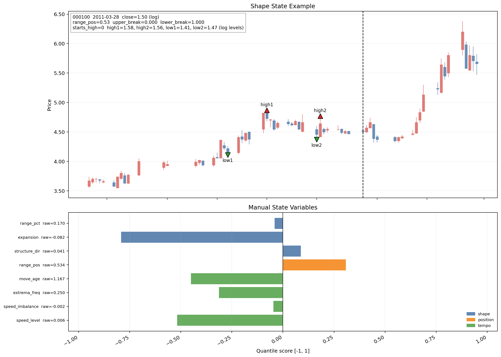
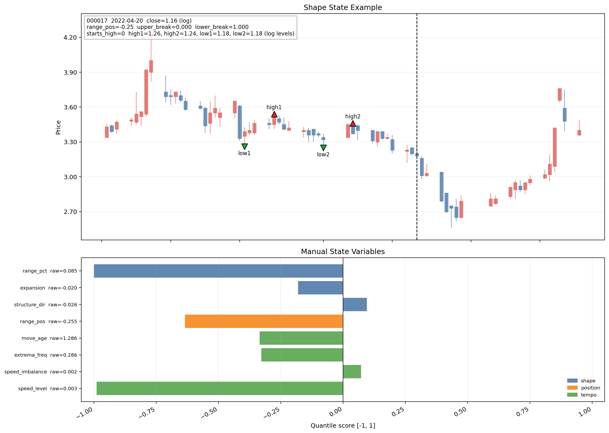
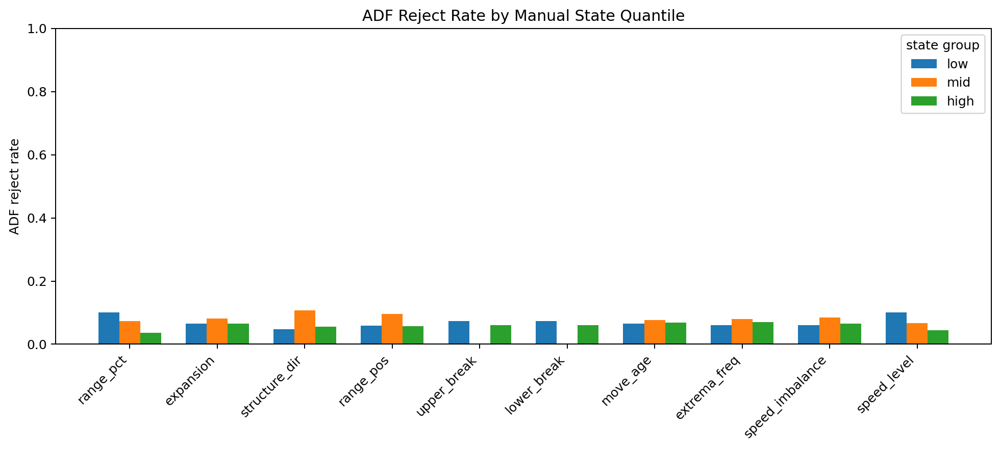
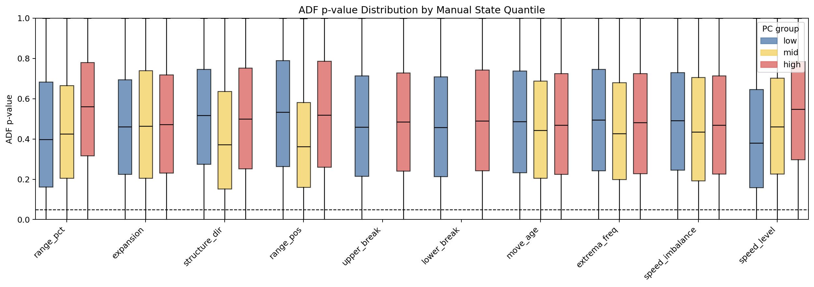
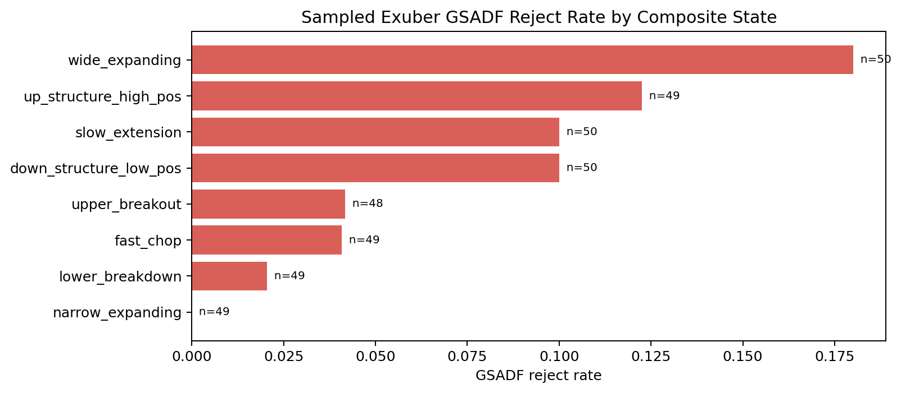
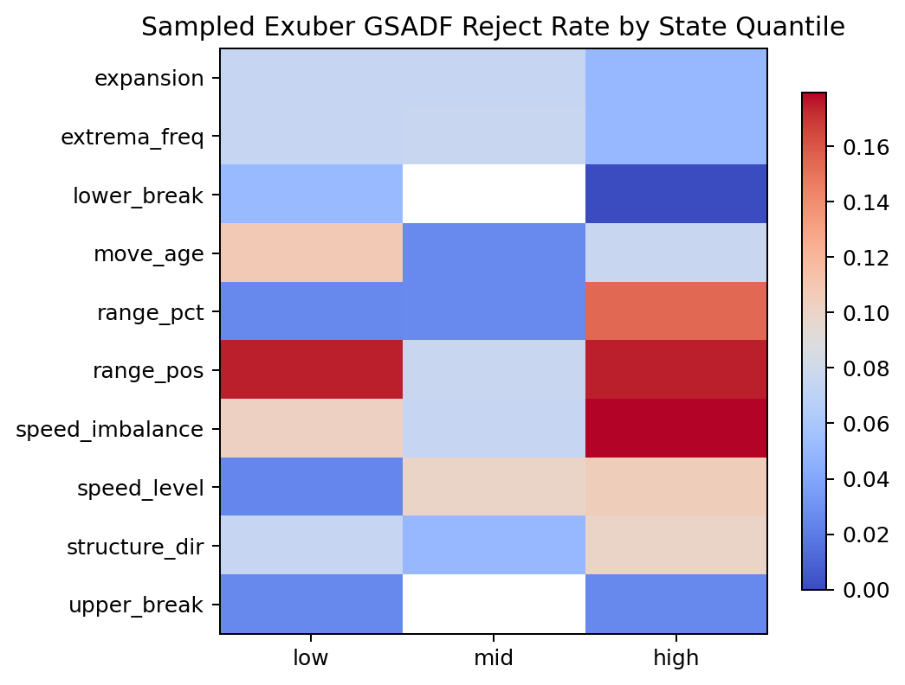

# Manual Market State Vector 实操报告

## 1. 报告目的

这份文档记录目前最终版市场形态状态向量的构造流程。它接着理论文档 `Note/理论/market_state_vector_design.md` 的思路往下做：先用在线 CPD 找出已经确认的局部高低点，再把最近四个交替高低点组成一个结构窗口，最后把这个窗口压成一组可以解释的状态变量。

前面试过 PCA 版本，但现在主线已经改成 manual variables。也就是说，最终结果不再输出 `pc1, pc2, ...` 作为状态，而是直接保留一组含义明确的变量，例如结构宽度、扩张收缩、结构方向、当前位置、上下轨突破、结构年龄和速度特征。

## 2. 理论框架

每个有效状态都来自最近四个已经确认的极值点：

$$
W_k = (E_{k-3}, E_{k-2}, E_{k-1}, E_k)
$$

因为高低点理论上交替出现，所以窗口主要有两种形式：

$$
H,L,H,L
\quad \text{或} \quad
L,H,L,H
$$

在每个窗口里，把两个高点按时间顺序记为 $H_1,H_2$，两个低点按时间顺序记为 $L_1,L_2$。最终状态变量主要回答几个问题：

- 这个结构现在宽不宽；
- 结构是在扩张还是收缩；
- 高低点整体是在上移还是下移；
- 当前价格在结构区间里的位置；
- 当前价格有没有突破动态上轨或下轨；
- 这个结构离最近确认点过去了多久；
- 极值点出现得密不密；
- 高点和低点变化速度是否不对称。

## 3. 数据和在线结构确认

当前主线样本使用本地 AKShare 下载的 A 股日频 OHLCV 数据，区间为 `2010-01-01` 到 `2026-05-29`，本轮完整流程跑了前 80 支股票。

输出目录是：

```text
market_state_vector_builder/outputs/shape_state_analysis_manual
```

本轮运行命令是：

```powershell
python market_state_vector_builder/02_build_state/build_manual_state.py ^
  --input-dir data/a_share_1d_akshare/symbols ^
  --out-dir market_state_vector_builder/outputs/shape_state_analysis_manual ^
  --max-symbols 80 ^
  --start 2010-01-01 ^
  --end 2026-05-29 ^
  --log-price ^
  --detector-method cusum ^
  --detector-q 1.0 ^
  --cpd-confirm-lag 0 ^
  --n-lags 0
```

这里 `--log-price` 的意思是从 CPD 阶段开始就使用对数价格。后面的状态变量也按 log price 口径计算，例如：

$$
\text{high\_change} = \log H_2 - \log H_1
$$

而不是写成：

$$
\frac{\log H_2 - \log H_1}{\log H_1}
$$

后一种写法分母没有清楚的金融含义，所以已经放弃。当前这版的口径可以理解为：所有价格水平先转成 log price，然后在 log price 空间里做 CPD、极值确认和状态变量计算。

## 4. 从 PCA 到 Manual 变量

最开始的方案是先构造一批结构变量，再做 PCA，得到类似：

```text
shape_pc1, shape_pc2, ...
```

这个版本的好处是维度低，但问题也很明显：PC 是线性组合，容易把不同含义混在一起。最典型的是 PC1，它同时吃到了结构宽度、扩张收缩、通道距离等信息。PC1 高的时候，可能是结构本来就宽，也可能是结构正在扩张，还可能是动态通道变化造成的。

也就是说，有的时候PCA会反映出某种特定的直观组合，但是也有时候PCA 会拆出一些不太直观的组合方向，不适合作为最终状态。

所以现在的决定是：PCA 作为辅助分析工具，利用一部分pca结果构造manual variables。但不作为最终状态向量。最终版本直接保留 manual variables。

## 5. 最终变量定义

当前最终状态变量一共 10 个：

| 变量 | 含义 | 高低值怎么理解 |
|---|---|---|
| `range_pct` | 结构区间 log 宽度，约等于 `log(upper_ref) - log(lower_ref)` | 越高表示最近四点形成的结构越宽 |
| `expansion` | 结构宽度变化，`high_change - low_change` | 正值偏扩张，负值偏收缩 |
| `structure_dir` | 连续结构方向，`high_change + low_change` | 正值表示高低点整体上移，负值表示整体下移 |
| `range_pos` | 当前价格在静态结构区间里的相对位置 | 接近 0 靠近下沿，接近 1 靠近上沿，大于 1 是上方越界，小于 0 是下方越界 |
| `upper_break` | 是否突破动态上轨 | 突破为 1，否则为 0 |
| `lower_break` | 是否跌破动态下轨 | 跌破为 1，否则为 0 |
| `move_age` | 距离最近结构窗口终点过去多久，并按近期极值间隔缩放 | 越高表示当前结构已经走得更久 |
| `extrema_freq` | 极值频率，`4 / window_bars` | 越高表示结构切换越密集 |
| `speed_imbalance` | 高低点变化速度差，`high_speed - low_speed` | 衡量上下边界运动速度是否不对称 |
| `speed_level` | 高低点变化速度和，`high_speed + low_speed` | 衡量整体边界变化速度 |

`structure_dir` 之前用过 sign 版本，也就是只保留方向正负。现在已经改成连续值，因为 sign 会把很弱和很强的方向都压成同一个 `1` 或 `-1`，信息损失太大。

`upper_break` 和 `lower_break` 之前也试过连续距离版本：

```text
upper_dist = log_close - log_upper_line_t
lower_dist = log_close - log_lower_line_t
```

后来保留了 `range_pos` 之后，这两个连续距离有些冗余，所以最终改成 0/1 突破变量：只记录是否突破动态上轨或下轨。

## 6. 原始值和 Score 的区别

输出文件里同时有原始变量和 `*_score` 变量。两者不是一回事。

原始值是状态变量本身，例如 `range_pct`、`expansion`、`range_pos`、`upper_break`。这些才是当前状态向量的实际取值，可以继续用于建模、分组、回测或实时计算。

`*_score` 是展示用的归一化分数。当前做法已经改成实时可用口径：对每只股票、每个连续变量，只用当前点之前最多 1000 个有效状态估计 5% 和 95% 滚动分位数，再把当前值映射到 `[-1, 1]`：

$$
\text{score} =
\operatorname{clip}\left(
2\frac{x-q_{05}}{q_{95}-q_{05}} - 1,\ -1,\ 1
\right)
$$

这里的 $q_{05,t}$ 和 $q_{95,t}$ 都来自 $t$ 之前的历史，不包含当前点，所以不会用到未来数据。前期历史不足时，连续变量的 score 会暂时为空；当前默认至少需要 100 个历史有效状态。`upper_break` 和 `lower_break` 是 0/1 变量，不走滚动分位数，而是固定映射成 `0 -> -1`、`1 -> 1`。

所以 `score` 的主要作用是画图和人工比较，让不同量纲的变量看起来更直观。它不替代原始变量。实时计算时也应该优先保留原始变量，再额外生成 score 作为展示层。

## 7. 当前 80 股票输出结果

本轮完整构建结果：

| 项目 | 数值 |
|---|---:|
| 股票数 | 80 |
| 原始输出行数 | 300010 |
| 有效 manual state 行数 | 297898 |
| 时间区间 | 2010-01-01 到 2026-05-29 |
| CPD 方法 | `cusum` |
| detector q | 1.0 |
| CPD 确认滞后 | 0 |
| lag state | 0 |
| 构建耗时 | 约 72.6 分钟 |

状态变量的几个整体特征：

| 变量 | 中位数 | 5% | 95% |
|---|---:|---:|---:|
| `range_pct` | 0.1752 | 0.0857 | 0.4060 |
| `expansion` | -0.0009 | -0.1760 | 0.1738 |
| `structure_dir` | -0.0076 | -0.2714 | 0.2454 |
| `range_pos` | 0.4338 | -0.4224 | 1.2310 |
| `move_age` | 1.2000 | 0.2000 | 4.4000 |
| `extrema_freq` | 0.2105 | 0.0816 | 0.5714 |
| `speed_imbalance` | 0.0002 | -0.0108 | 0.0126 |
| `speed_level` | 0.0085 | 0.0017 | 0.0348 |

`upper_break` 的均值约为 0.239，`lower_break` 的均值约为 0.234。也就是说，在当前动态上下轨定义下，样本里大约四分之一左右的状态会出现上轨或下轨突破标记。

## 8. 样本图检查

样本图目录：

```text
market_state_vector_builder/outputs/shape_state_analysis_manual/examples
```

当前随机抽了 10 个样本点，每张图包括：

- K 线走势；
- 最近四个结构极值点；
- 动态上轨和下轨；
- 当前点位置；
- 右侧状态变量面板；
- 原始变量值和对应 score。

示例图索引文件：

```text
market_state_vector_builder/outputs/shape_state_analysis_manual/examples/examples_index.csv
```

示例图包括：



含义：当前振幅小；结构偏向收缩而非扩张；整体趋势略偏向上；当前点在结构中位置为中间略靠上；当前点距离上一次极值点时间不久；当前极值变动频率很低；当前下边界变化速度大于上边界；当前整体边界变化较慢。同时当前由于lower_break小于0，说明已经跌破了下方趋势线（不过由于目前为收缩形态，这个没有什么实际含义）。



这些图主要用于人工检查：四个极值点是否落在合理位置、动态上下轨是否符合直觉、状态变量和 K 线形态是否能对得上。

## 9. ADF 验证

本轮 ADF 窗口数为 295290，覆盖 80 支股票。按状态变量 low/mid/high 分组后，拒绝率整体不高，主要结果是：

- `structure_dir = mid` 的 ADF 拒绝率最高，约 10.68%；
- `range_pct = low` 的拒绝率约 10.10%；
- `speed_level = low` 的拒绝率约 10.06%；
- `range_pct = high` 的拒绝率最低，约 3.63%。

直观解释是：很宽的结构区间下，价格更不容易表现出短窗口均值回归或平稳特征；而结构方向不极端、结构较窄或速度较低的一些状态里，ADF 更容易拒绝单位根。但这个结果只是状态分组下的统计现象，不等于单独的交易信号。





## 10. Monte Carlo 稳定性

当前最终版本不再使用 PCA 作为状态向量，所以也不再需要专门做 PCA 解释率或 loading 的 Monte Carlo 稳定性检验；这部分从主流程中删除。

## 11. 爆炸性检验

爆炸性检验使用 R 的 `exuber` 包，对抽样窗口做 GSADF/BSADF 类检验。

原理上，它和普通 ADF 的方向相反。ADF 通常检验价格序列是否有单位根，备择方向偏向平稳；爆炸性检验做的是右尾单位根检验，关心的是自回归系数是否显著大于 1。直观说，如果一段价格可以近似写成：

$$
y_t = \rho y_{t-1} + \epsilon_t
$$

普通单位根大致看 $\rho = 1$ 能不能被拒绝，而爆炸性检验看的是有没有证据支持 $\rho > 1$。$\rho > 1$ 表示冲击会被放大，价格不是普通随机游走，而是出现局部加速上冲或泡沫式扩张。

GSADF/BSADF 的做法不是只在整段样本上检验一次，而是在同一个窗口里反复改变起点和终点，找出是否存在某一小段时间具有右尾爆炸性。这样比普通 ADF 更适合识别“局部出现、随后消失”的爆炸性行情。这里按状态变量分组，是为了看哪些形态状态下更容易出现这种局部右尾爆炸。

本轮导出了 1495 个窗口，合计 89700 条窗口内观测。R 检验完成后，整体 reject rate 约为 7.69%。

这里的 reject rate 越高，表示该状态分组里的窗口越频繁拒绝“没有爆炸性”的原假设，也就是越容易检出右尾爆炸性；reject rate 低则说明这类状态下爆炸性证据较少。

组合状态的定义是人为规则，不是 PCA 或聚类。具体做法是先把每个状态变量按三分位切成 `low/mid/high`，再按下面的条件打标签：

| 状态标签 | 构造规则 | 含义 |
|---|---|---|
| `wide_expanding` | `range_pct_group = high` 且 `expansion_group = high` | 结构区间较宽，同时处于扩张状态 |
| `narrow_expanding` | `range_pct_group = low` 且 `expansion_group = high` | 结构区间较窄，但正在扩张 |
| `upper_breakout` | `upper_break_group = high` 且 `range_pos_group = high` | 当前价格突破动态上轨，同时处在结构区间偏高位置 |
| `lower_breakdown` | `lower_break_group = high` 且 `range_pos_group = low` | 当前价格跌破动态下轨，同时处在结构区间偏低位置 |
| `fast_chop` | `extrema_freq_group = high` 且 `speed_level_group = high` | 极值频率高、边界变化速度高，偏快速震荡 |
| `slow_extension` | `move_age_group = high` 且 `speed_level_group = low` | 结构年龄较高、边界变化速度低，偏慢速延伸 |
| `up_structure_high_pos` | `structure_dir_group = high` 且 `range_pos_group = high` | 结构整体上移，且当前价格处在结构区间偏高位置 |
| `down_structure_low_pos` | `structure_dir_group = low` 且 `range_pos_group = low` | 结构整体下移，且当前价格处在结构区间偏低位置 |

如果同一个点满足多个组合状态，代码会按上表顺序依次赋值，后面的规则会覆盖前面的标签。因此 `up_structure_high_pos` 和 `down_structure_low_pos` 的优先级最高。

组合状态下，本轮样本里爆炸性拒绝率相对较高的是：

- `wide_expanding`：18.00%；
- `up_structure_high_pos`：12.24%；
- `down_structure_low_pos`：10.00%；
- `slow_extension`：10.00%。

单变量分位数组里，拒绝率较高的是：

- `speed_imbalance = high`：17.95%；
- `range_pos = high`：17.50%；
- `range_pos = low`：17.50%；
- `range_pct = high`：15.38%。

这说明爆炸性更多出现在结构偏极端的位置、较宽结构或上下速度不均衡的状态里。但当前只是抽样窗口检验，样本数比 ADF 小，结论需要继续扩大样本后确认。





## 12. 当前结论

目前最重要的结论是：最终版不再把形态状态压成 PCA，而是直接用 10 个 manual variables 表达。这样牺牲了一点“低维压缩”，但换来了更直接的解释能力。目前的几类测试结果都比较符合预期。

当前这套变量已经能覆盖几类核心形态信息：

- `range_pct` 和 `expansion` 表达宽度和扩张收缩；
- `structure_dir` 表达结构方向；
- `range_pos`、`upper_break`、`lower_break` 表达当前位置和突破；
- `move_age`、`extrema_freq` 表达结构时间特征；
- `speed_imbalance`、`speed_level` 表达边界变化速度。

后续如果要做实时化，当前状态变量和 rolling score 已经可以按在线口径计算；还需要单独固定的是变量筛选规则、检验阈值，以及任何用于回测或分组的统计规则。
