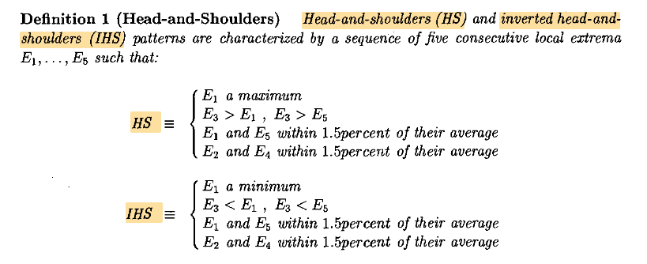
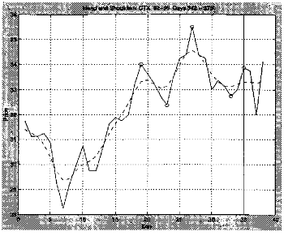
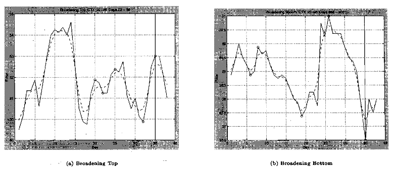
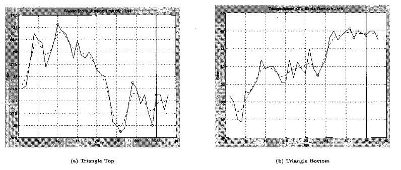
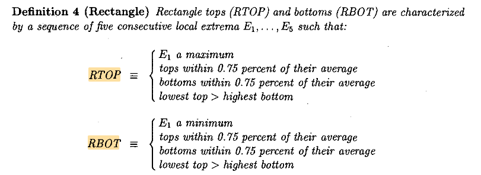
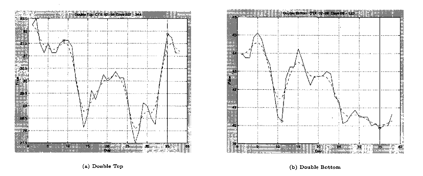

# 基于确认极值事件的市场状态向量设计

## 核心思想

目前构造出一种用于实时在线更新的市场状态向量构造方法。该方法类似技术形态方法，但核心不是直接识别或枚举技术形态，而是将这些形态背后的几何关系转化为连续的结构变量，使后续模型能够从变量组合中学习不同市场结构。

原始价格序列记为
$$
P_1,P_2,\ldots,P_t.
$$

通过在线极值检测方法，可以得到一列已经确认的局部极值：
$$
E_1,E_2,\ldots,E_k,
$$

其中每个极值定义为
$$
E_i=(p_i,\tau_i,q_i),
$$

这里 $p_i$ 表示极值价格，$\tau_i$ 表示极值发生时间，$q_i\in\{H,L\}$ 表示该极值是高点还是低点。

由于极值高低交替出现，因此每当一个新的极值 $E_k$ 被确认，就可以构造一个由最近四个极值组成的结构窗口：
$$
W_k=[E_{k-3},E_{k-2},E_{k-1},E_k].
$$

该窗口只可能是两种形式：
$$
H L H L
$$

或
$$
L H L H.
$$

对每个结构窗口计算连续结构变量：
$$
Z_k=\phi(W_k).
$$

其中 $\phi(\cdot)$ 是结构变量生成函数。它的作用是把窗口内两个高点、两个低点之间的相对变化、区间宽度、压缩扩张、斜率和时间间隔等信息表达成数值特征。

在当前时间点 $t$，市场状态向量可以写成：
$$
State_t=[Z_k,Z_{k-1},Z_{k-2},\ldots,Z_{k-m},Position_t],
$$

其中 $Z_k,\ldots,Z_{k-m}$ 是最近若干个结构窗口的结构向量，$Position_t$ 表示当前价格 $C_t$ 相对于最近结构的位置。

这个框架的关键在于：复杂形态不是通过人工标签写入状态向量，而是通过多个相邻结构窗口之间的数值关系被模型学习出来。

其实我最开始的想法是构造出论文原文的技术形态，比如头肩顶用的是五个极值点来表达的，但是这样会有一个问题：不同的技术形态需要的极值点数量不同，
如果我们现在用的是每一个时刻的向量之前的很多个极值，那么会塞进来很多冗余信息。所以我决定用两高两低作为基准，其信息含量足够了，而且再多
极值点的话需要构造的变量也会增加很多。至于为什么能表达可以看后续的头肩顶、头肩底、扩张等示例。

## 结构窗口的基础变量

对于任意一个四点结构窗口 $W_k$，将其中两个高点按时间顺序记为
$$
H_1,H_2,
$$

两个低点按时间顺序记为
$$
L_1,L_2.
$$

其中 $H_2$ 是较新的高点，$L_2$ 是较新的低点。

基础结构变量可以包括高点相对变化：
$$
dH_k=\frac{H_2-H_1}{(H_1+H_2)/2},
$$

低点相对变化：
$$
dL_k=\frac{L_2-L_1}{(L_1+L_2)/2},
$$

以及窗口起始类型：
$$
s_k=I(E_{k-3}\text{ is High}).
$$

如果 $s_k=1$，则窗口为 $H L H L$；如果 $s_k=0$，则窗口为 $L H L H$。

还可以定义窗口区间宽度：
$$
Range_k=\max(H_1,H_2)-\min(L_1,L_2),
$$

以及宽度变化：
$$
WidthChange_k=\frac{(H_2-L_2)-(H_1-L_1)}{|H_1-L_1|}.
$$

加入极值时间信息，还可以定义高点连线斜率和低点连线斜率：
$$
SlopeH_k=\frac{H_2-H_1}{\tau_{H_2}-\tau_{H_1}},
$$

$$
SlopeL_k=\frac{L_2-L_1}{\tau_{L_2}-\tau_{L_1}}.
$$

这些变量并不直接说明当前形态是什么，而是描述结构的几何本质。模型可以利用这些连续变量学习形态，而不需要人为规定阈值。

## 当前价格位置变量

结构窗口 $Z_k$ 描述已经形成的极值结构，但实时市场状态还必须包含当前价格 $C_t$ 相对于该结构的位置。

定义最近结构的上沿和下沿：
$$
Upper_k=\max(H_1,H_2),
$$

$$
Lower_k=\min(L_1,L_2).
$$

当前价格在结构区间中的标准化位置为：
$$
Pos_t=\frac{C_t-Lower_k}{Upper_k-Lower_k}.
$$

当 $Pos_t\approx 1$ 时，当前价格靠近结构上沿；当 $Pos_t\approx 0$ 时，当前价格靠近结构下沿。

还可以定义：
$$
DistUpper_t=\frac{Upper_k-C_t}{Upper_k-Lower_k},
$$

$$
DistLower_t=\frac{C_t-Lower_k}{Upper_k-Lower_k},
$$

$$
BreakUp_t=I(C_t>Upper_k),
$$

$$
BreakDown_t=I(C_t<Lower_k).
$$

这部分变量回答的问题是：当前价格在已形成结构中的什么位置？而结构向量 $Z_k$ 回答的问题是：最近确认的高低点形成了怎样的几何结构。

## 头肩顶示例

论文中头肩顶由五个连续局部极值定义：
$$
E_1,E_2,E_3,E_4,E_5,
$$

其中 $E_1,E_3,E_5$ 是高点，$E_2,E_4$ 是低点。其核心条件可以概括为：中间高点高于两侧高点，左右肩高度接近，两个低点即颈线点接近。

用价格符号表示：
$$
H_L,L_1,H_{Head},L_2,H_R.
$$

如果直接使用五点结构，就需要显式保留三个高点和两个低点。但在当前框架中，可以用两个连续的四点窗口表达这个五点结构。

前一个窗口为：
$$
W_{k-1}=H_L,L_1,H_{Head},L_2.
$$

当前窗口为：
$$
W_k=L_1,H_{Head},L_2,H_R.
$$

这两个窗口重叠三个点，合起来覆盖完整的头肩顶结构：
$$
H_L,L_1,H_{Head},L_2,H_R.
$$

前一个窗口的高点变化为：
$$
dH_{k-1}
=
\frac{H_{Head}-H_L}{(H_{Head}+H_L)/2}.
$$

如果
$$
dH_{k-1}>0,
$$

说明头部高于左肩。

当前窗口的高点变化为：
$$
dH_k
=
\frac{H_R-H_{Head}}{(H_R+H_{Head})/2}.
$$

如果
$$
dH_k<0,
$$

说明右肩低于头部。

左右肩是否接近，可以通过
$$
ShoulderBalance_k=dH_{k-1}+dH_k
$$

表达。如果 $dH_{k-1}$ 与 $dH_k$ 的绝对幅度接近且方向相反，则
$$
ShoulderBalance_k\approx 0,
$$

表示左右肩高度相对接近。

颈线是否平整，可以用当前窗口中的两个低点：
$$
dL_k
=
\frac{L_2-L_1}{(L_1+L_2)/2}.
$$

若
$$
dL_k\approx 0,
$$

说明两个低点接近，颈线较平。

因此，头肩顶并不需要被写成一个离散标签，而可以由以下连续变量组合表达：
$$
s_{k-1}=1,\quad s_k=0,
$$

$$
dH_{k-1}>0,\quad dH_k<0,
$$

$$
dH_{k-1}+dH_k\approx 0,
$$

$$
dL_k\approx 0.
$$

进一步加入当前价格位置：
$$
Neckline_k=\frac{L_1+L_2}{2},
$$

$$
CurrentToNeckline_t=
\frac{C_t-Neckline_k}{H_{Head}-Neckline_k}.
$$

当该变量逐渐下降并跌破 0 时，说明价格接近或跌破颈线。模型可以从这些连续变量中学习头肩顶完成或失败后的价格行为，而不需要手工设定固定阈值。

## 头肩底示例

头肩底是头肩顶的镜像结构。其五点结构可表示为：
$$
L_L,H_1,L_{Head},H_2,L_R.
$$

前一个窗口为：
$$
W_{k-1}=L_L,H_1,L_{Head},H_2.
$$

当前窗口为：
$$
W_k=H_1,L_{Head},H_2,L_R.
$$

前一个窗口的低点变化为：
$$
dL_{k-1}
=
\frac{L_{Head}-L_L}{(L_{Head}+L_L)/2}.
$$

若
$$
dL_{k-1}<0,
$$

说明头部低点低于左肩低点。

当前窗口的低点变化为：
$$
dL_k
=
\frac{L_R-L_{Head}}{(L_R+L_{Head})/2}.
$$

若
$$
dL_k>0,
$$

说明右肩低点高于头部低点。

左右肩低点的平衡性可以写成：
$$
BottomShoulderBalance_k=dL_{k-1}+dL_k.
$$

若该值接近 0，则说明左右肩低点大致对称。

颈线由两个高点 $H_1,H_2$ 构成：
$$
dH_k=\frac{H_2-H_1}{(H_1+H_2)/2}.
$$

若
$$
dH_k\approx 0,
$$

说明颈线较平。

当前价格相对颈线的位置可以定义为：
$$
Neckline_k=\frac{H_1+H_2}{2},
$$

$$
CurrentToNeckline_t=
\frac{C_t-L_{Head}}{Neckline_k-L_{Head}}.
$$

当该值接近或超过 1 时，说明价格接近或突破颈线。

## 扩张形态 Broadening 示例

扩张形态的本质是区间逐步变宽。对于 broadening top，可以表示为：
$$
H_0,L_1,H_1,L_2,H_2.
$$

前一个窗口：
$$
W_{k-1}=H_0,L_1,H_1,L_2.
$$

当前窗口：
$$
W_k=L_1,H_1,L_2,H_2.
$$

高点变化为：
$$
dH_{k-1}
=
\frac{H_1-H_0}{(H_1+H_0)/2},
$$

$$
dH_k
=
\frac{H_2-H_1}{(H_2+H_1)/2}.
$$

如果
$$
dH_{k-1}>0,\quad dH_k>0,
$$

说明高点连续抬高。

低点变化为：
$$
dL_k
=
\frac{L_2-L_1}{(L_2+L_1)/2}.
$$

如果
$$
dL_k<0,
$$

说明低点下降。

扩张强度可以定义为：
$$
Expansion_k=dH_k-dL_k.
$$

当 $dH_k>0$ 且 $dL_k<0$ 时，$Expansion_k$ 越大，说明区间扩张越明显。

当前价格位置为：
$$
Pos_t=\frac{C_t-\min(L_1,L_2)}{\max(H_1,H_2)-\min(L_1,L_2)}.
$$

如果价格位于高位且扩张强度增强，模型可以学习到扩张顶部、波动放大或结构失稳等状态。

## 收敛三角形 Triangle 示例

收敛三角形的本质是高点下降、低点上升，即价格区间逐渐收窄。以五点结构为例：
$$
H_0,L_1,H_1,L_2,H_2.
$$

如果满足：
$$
H_0>H_1>H_2,
$$

且
$$
L_1<L_2,
$$

则对应区间收敛。

用窗口变量表示：
$$
dH_{k-1}<0,\quad dH_k<0,
$$

$$
dL_k>0.
$$

收敛强度可以定义为：
$$
Compression_k=dL_k-dH_k.
$$

当 $dL_k>0$ 且 $dH_k<0$ 时，$Compression_k$ 越大，说明低点上移和高点下移越明显。

也可以用宽度变化来表达：
$$
Width_k=H_2-L_2,
$$

$$
Width_{k-1}=H_1-L_1,
$$

$$
WidthChange_k=\frac{Width_k-Width_{k-1}}{Width_{k-1}}.
$$

如果
$$
WidthChange_k<0,
$$

说明区间收缩。

当前价格位置可以相对于上下边界定义：
$$
Pos_t=\frac{C_t-LowerLine_t}{UpperLine_t-LowerLine_t}.
$$

其中 $UpperLine_t$ 可以由最近两个高点连线外推得到，$LowerLine_t$ 可以由最近两个低点连线外推得到。这样可以描述价格处于三角形内部的什么位置。

## 矩形 Rectangle 示例

矩形结构的本质是顶部接近、底部接近，价格在较稳定区间内波动。以五点结构为例：
$$
H_0,L_1,H_1,L_2,H_2.
$$

其核心关系为：
$$
H_0\approx H_1\approx H_2,
$$

$$
L_1\approx L_2.
$$

用窗口变量表示：
$$
dH_{k-1}\approx 0,
$$

$$
dH_k\approx 0,
$$

$$
dL_k\approx 0.
$$

顶部平整度可以定义为：
$$
TopFlat_k=|dH_k|,
$$

结合前一窗口：
$$
TopFlatAll_k=|dH_{k-1}|+|dH_k|.
$$

底部平整度为：
$$
BottomFlat_k=|dL_k|.
$$

可以保留
$$
TopFlatAll_k,\quad BottomFlat_k
$$

作为模型输入，让模型自己学习多平才有意义，而不强行设定阈值。

当前价格位置：
$$
Resistance_k=\frac{H_1+H_2}{2},
$$

$$
Support_k=\frac{L_1+L_2}{2},
$$

$$
Pos_t=\frac{C_t-Support_k}{Resistance_k-Support_k}.
$$

如果 $Pos_t$ 在 0 和 1 之间反复变化，模型可以学习区间震荡；如果超过 1 或低于 0，模型可以学习矩形突破或破位。

## 双顶 Double Top 示例

双顶与头肩顶、三角形、矩形等局部五点结构不同。原文中的双顶并不是只在一个固定四点窗口内部判断，而是从某一个局部高点出发，在后续极值序列中寻找另一个与其高度接近的局部高点，并且要求两个高点之间存在一定时间间隔。因此，在本文的状态向量框架中，双顶不应被理解为单个窗口内部可以直接定义的形态，而应被理解为多个结构窗口之间可以被模型学习到的跨窗口关系。

本文保持一个基本原则：每一个结构窗口向量 $Z_k$ 只由当前四极值窗口 $W_k$ 内部的信息计算得到。跨窗口关系不在单个 $Z_k$ 内部手工构造，而是通过多个窗口向量
$$
[Z_k,Z_{k-1},Z_{k-2},\ldots,Z_{k-m}]
$$

共同输入模型，由模型学习不同窗口之间的高点接近、时间间隔、中间回撤和当前价格位置之间的关系。

设当前四极值窗口为
$$
W_k=[E_{k-3},E_{k-2},E_{k-1},E_k],
$$

其中每个极值点为
$$
E_i=(p_i,\tau_i,q_i),
$$

$p_i$ 为极值价格，$\tau_i$ 为极值发生或确认时间，$q_i\in\{H,L\}$ 表示高点或低点。

若当前窗口为
$$
W_k=H_1,L_1,H_2,L_2,
$$

则该窗口内部可以计算两个高点的相对变化：
$$
dH_k
=
\frac{H_2-H_1}{(H_1+H_2)/2}.
$$

两个低点的相对变化为：
$$
dL_k
=
\frac{L_2-L_1}{(L_1+L_2)/2}.
$$

窗口内部的回撤强度可以写为：
$$
Pullback_k
=
\frac{(H_1+H_2)/2-\min(L_1,L_2)}
{(H_1+H_2)/2}.
$$

两个高点之间的时间间隔为：
$$
HighGap_k=\tau_{H_2}-\tau_{H_1}.
$$

这些变量描述的是当前窗口内部的局部形状。它们可以反映当前窗口中两个高点是否接近、两个高点之间是否存在回撤，以及窗口内部的时间跨度。但是，仅有这些窗口内部差分变量还不足以表达原文意义上的双顶，因为双顶的关键是：
$$
\text{当前高点是否接近过去某一个高点}.
$$

因此，单窗口结构向量 $Z_k$ 中还需要保留可跨窗口比较的极值水平变量。

需要注意的是，这里的极值水平变量不应使用每个窗口自身的当前价格作为局部标准化基准。否则，不同窗口中的极值会处在不同坐标系中，模型难以比较不同窗口之间的高点或低点是否处于相近价位。因此，在这里直接保留极值在同一价格坐标系下的水平。本文将单窗口结构向量分为两部分：
$$
Z_k=[Z_k^{shape},Z_k^{level}].
$$

其中，$Z_k^{shape}$ 表示窗口内部的相对形状变量：
$$
Z_k^{shape}
=
[dH_k,dL_k,Pullback_k,HighGap_k].
$$

$Z_k^{level}$ 表示极值在原始价格坐标系或对数价格坐标系下的位置。可以直接使用原始极值价格：
$$
Z_k^{level}
=
[H_1,H_2,L_1,L_2].
$$

也可以使用对数价格：
$$
x_{H_1,k}=\log H_1,
\qquad
x_{H_2,k}=\log H_2,
$$

$$
x_{L_1,k}=\log L_1,
\qquad
x_{L_2,k}=\log L_2.
$$

由于同一个品种的不同结构窗口处在同一价格坐标系中，模型可以直接比较不同窗口中的极值水平。例如，若当前窗口中的某个高点 $H_{r,k}$ 与历史窗口中的某个高点 $H_{s,k-j}$ 接近，则在价格坐标下表现为：
$$
H_{r,k}-H_{s,k-j}\approx 0,
\qquad j=1,\ldots,m.
$$

如果使用对数价格，则表现为：
$$
x_{H_r,k}-x_{H_s,k-j}\approx 0,
\qquad j=1,\ldots,m.
$$

这一关系对应于双顶结构中“两个高点处于相近价位”。

于是，对于一个 $H_1,L_1,H_2,L_2$ 型窗口，单窗口结构向量中与双顶相关的信息可以写为：
$$
Z_k^{DT}
=
\left[
dH_k,\,
dL_k,\,
Pullback_k,\,
HighGap_k,\,
H_1,\,
H_2,\,
L_1,\,
L_2
\right].
$$

或者在对数价格坐标下写为：
$$
Z_k^{DT}
=
\left[
dH_k,\,
dL_k,\,
Pullback_k,\,
HighGap_k,\,
x_{H_1,k},\,
x_{H_2,k},\,
x_{L_1,k},\,
x_{L_2,k}
\right].
$$

当前价格相对于最近结构的位置也需要加入状态向量。设
$$
Upper_k=\max(H_1,H_2),
\qquad
Lower_k=\min(L_1,L_2),
$$

则当前价格在该窗口上下边界中的相对位置为：
$$
Pos_k(t)
=
\frac{C_t-Lower_k}{Upper_k-Lower_k}.
$$

也可以定义当前价格距离结构下沿的位置：
$$
DistLower_k(t)
=
\frac{C_t-Lower_k}{Upper_k-Lower_k}.
$$

若当前价格已经跌破该窗口下沿，则可以定义：
$$
BreakDown_k(t)
=
I(C_t<Lower_k).
$$

因此，在本文框架下，双顶不是由某个单窗口规则直接定义，而是由多窗口状态向量表达：
$$
State_t
=
[Z_k,Z_{k-1},Z_{k-2},\ldots,Z_{k-m},Position_t].
$$

其中，每个 $Z_k$ 只包含当前窗口内部可计算的信息，但由于其中保留了同一价格坐标系下的极值水平，模型可以在多个 $Z$ 之间学习：
$$
\text{不同窗口中的高点是否接近},
$$

$$
\text{两个高点之间是否存在明显回撤},
$$

$$
\text{两个高点之间的时间间隔是否足够},
$$

$$
\text{当前价格是否正在接近或跌破中间低点附近区域}.
$$

也就是说，状态向量不直接给出“双顶是否成立”的人工标签，而是提供足够的局部形状信息、极值水平信息和当前位置变量，让模型自动学习双顶结构及其预测意义。

## 双底 Double Bottom 示例

双底是双顶的镜像结构。原文中的双底同样不是单个四点窗口内部的固定关系，而是从某一个局部低点出发，在后续极值序列中寻找另一个与其高度接近的局部低点，并且要求两个低点之间存在一定时间间隔。因此，在本文的状态向量框架中，双底也应被理解为多个结构窗口之间可以被模型学习到的跨窗口关系。

与双顶部分一致，本文仍然保持单窗口向量的基本原则：每一个 $Z_k$ 只由当前窗口 $W_k$ 内部的信息计算得到，跨窗口相似性不在单个 $Z_k$ 内部手工构造，而是通过多窗口状态向量交给模型学习。

若当前窗口为
$$
W_k=L_1,H_1,L_2,H_2,
$$

则该窗口内部两个低点的相对变化为：
$$
dL_k
=
\frac{L_2-L_1}{(L_1+L_2)/2}.
$$

两个高点的相对变化为：
$$
dH_k
=
\frac{H_2-H_1}{(H_1+H_2)/2}.
$$

窗口内部的反弹强度可以写为：
$$
Rebound_k
=
\frac{\max(H_1,H_2)-(L_1+L_2)/2}
{(L_1+L_2)/2}.
$$

两个低点之间的时间间隔为：
$$
LowGap_k=\tau_{L_2}-\tau_{L_1}.
$$

这些变量描述的是当前窗口内部的局部形状。它们可以反映当前窗口中两个低点是否接近、两个低点之间是否存在反弹，以及窗口内部的时间跨度。但是，仅有这些窗口内部差分变量还不足以表达原文意义上的双底，因为双底的关键是：
$$
\text{当前低点是否接近过去某一个低点}.
$$

因此，单窗口结构向量 $Z_k$ 中同样需要保留可跨窗口比较的极值水平变量。

与双顶类似，单窗口结构向量可以分为：
$$
Z_k=[Z_k^{shape},Z_k^{level}].
$$

其中，$Z_k^{shape}$ 表示窗口内部的相对形状变量：
$$
Z_k^{shape}
=
[dL_k,dH_k,Rebound_k,LowGap_k].
$$

$Z_k^{level}$ 表示极值在原始价格坐标系或对数价格坐标系下的位置。可以直接使用原始极值价格：
$$
Z_k^{level}
=
[L_1,L_2,H_1,H_2].
$$

也可以使用对数价格：
$$
x_{L_1,k}=\log L_1,
\qquad
x_{L_2,k}=\log L_2,
$$

$$
x_{H_1,k}=\log H_1,
\qquad
x_{H_2,k}=\log H_2.
$$

由于同一个品种的不同结构窗口处在同一价格坐标系中，模型可以直接比较不同窗口中的极值水平。例如，若当前窗口中的某个低点 $L_{r,k}$ 与历史窗口中的某个低点 $L_{s,k-j}$ 接近，则在价格坐标下表现为：
$$
L_{r,k}-L_{s,k-j}\approx 0,
\qquad j=1,\ldots,m.
$$

如果使用对数价格，则表现为：
$$
x_{L_r,k}-x_{L_s,k-j}\approx 0,
\qquad j=1,\ldots,m.
$$

这一关系对应于双底结构中“两个低点处于相近价位”。

于是，对于一个 $L_1,H_1,L_2,H_2$ 型窗口，单窗口结构向量中与双底相关的信息可以写为：
$$
Z_k^{DB}
=
\left[
dL_k,\,
dH_k,\,
Rebound_k,\,
LowGap_k,\,
L_1,\,
L_2,\,
H_1,\,
H_2
\right].
$$

或者在对数价格坐标下写为：
$$
Z_k^{DB}
=
\left[
dL_k,\,
dH_k,\,
Rebound_k,\,
LowGap_k,\,
x_{L_1,k},\,
x_{L_2,k},\,
x_{H_1,k},\,
x_{H_2,k}
\right].
$$

当前价格相对于最近结构的位置也需要加入状态向量。设
$$
Upper_k=\max(H_1,H_2),
\qquad
Lower_k=\min(L_1,L_2),
$$

则当前价格在该窗口上下边界中的相对位置为：
$$
Pos_k(t)
=
\frac{C_t-Lower_k}{Upper_k-Lower_k}.
$$

也可以定义当前价格距离结构上沿的位置：
$$
DistUpper_k(t)
=
\frac{Upper_k-C_t}{Upper_k-Lower_k}.
$$

若当前价格已经突破该窗口上沿，则可以定义：
$$
BreakUp_k(t)
=
I(C_t>Upper_k).
$$

因此，在本文框架下，双底不是由某个单窗口规则直接定义，而是由多窗口状态向量表达：
$$
State_t
=
[Z_k,Z_{k-1},Z_{k-2},\ldots,Z_{k-m},Position_t].
$$

其中，每个 $Z_k$ 只包含当前窗口内部可计算的信息，但由于其中保留了同一价格坐标系下的极值水平，模型可以在多个 $Z$ 之间学习：
$$
\text{不同窗口中的低点是否接近},
$$

$$
\text{两个低点之间是否存在明显反弹},
$$

$$
\text{两个低点之间的时间间隔是否足够},
$$

$$
\text{当前价格是否正在接近或突破中间高点附近区域}.
$$

也就是说，状态向量不直接给出“双底是否成立”的人工标签，而是提供足够的局部形状信息、极值水平信息和当前位置变量，让模型自动学习双底结构及其预测意义。

## 多窗口历史信息处理

不一定只使用前一个结构窗口。有些结构可能跨越更久，因此当前状态向量可以保留多个结构窗口：
$$
State_t=[Z_k,Z_{k-1},Z_{k-2},\ldots,Z_{k-m},Position_t].
$$

也可以对更早的窗口加入衰减权重：
$$
State_t=
[Z_k,\lambda Z_{k-1},\lambda^2 Z_{k-2},\ldots,\lambda^m Z_{k-m},Position_t],
$$

其中
$$
0<\lambda<1.
$$

这样近期结构权重大，较早结构仍然保留，但影响逐步下降。

另一种备选方案是使用 RNN 或 Transformer，把结构向量序列
$$
Z_{k-m},Z_{k-m+1},\ldots,Z_k
$$

作为序列输入，由模型自动学习哪些窗口更重要。显式窗口堆叠加衰减更简单、可解释；RNN 或 Transformer 的表达能力更强，但需要更多数据和更复杂的训练控制。

## 总结

整体流程可以概括为：
$$
\text{价格序列}
\rightarrow
\text{确认极值序列}
\rightarrow
\text{四点结构窗口}
\rightarrow
\text{连续结构变量}
\rightarrow
\text{多窗口状态向量}
\rightarrow
\text{模型学习}.
$$

关键不是直接判断：
$$
\text{当前是不是某个形态？}
$$

而是构造连续变量：
$$
dH_k,dL_k,s_k,WidthChange_k,Compression_k,Expansion_k,
TopFlat_k,BottomFlat_k,Pos_t,\ldots
$$

模型再从这些变量中学习：

- 什么样的高低点关系类似头肩顶或头肩底；
- 什么样的高点下降、低点上升类似三角形；
- 什么样的高低点平整类似矩形；
- 什么样的区间扩张类似 broadening；
- 当前价格在结构上沿、下沿、颈线附近或突破之后时意味着什么。

因此，该方法实现的是：用向量内容表达形态，而不是把形态标签做成向量。它保留了技术形态的几何含义，同时又让模型可以学习更加复杂、多样和非标准化的市场结构。

但是后续实际生成的向量是基于这个基础上，通过PCA判别后，再手动构造出来的。
